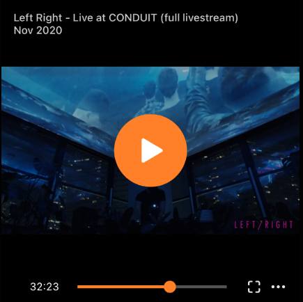
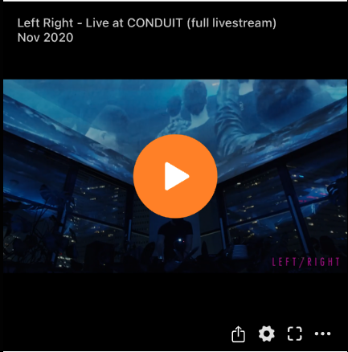
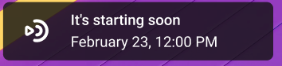
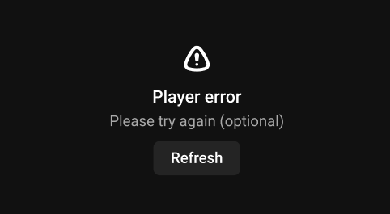
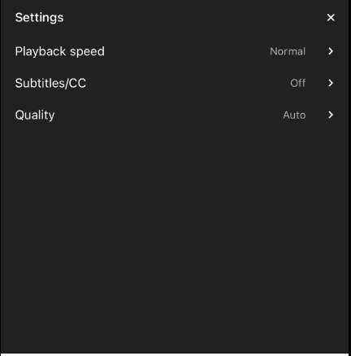

# PlayerView customisation



All components of `KinescopePlayerView` is partially customisable. You can change colors, fonts, sizes using method `KinescopePlayerView.setLayout(with config: KinescopePlayerViewConfiguration)`. 

All properties of `KinescopePlayerViewConfiguration` have default values included in SDK, so customisation is optional. 

You can easily edit these values using builders.
For examle to change color of timeline in control panel you can use this code:
```swift
playerView.setLayout(with: .builder().setControlPanel(
                .builder()
                    .setTimeline(
                        .builder()
                            .setActiveColor(color)
                            .build()
                    )
                    .build())
)
```
or you can use predefined configurable configuration `accentTimeLineAndPlayButton` to change color of timeline and play button in control panel. 

Using these builders you can change any property of `KinescopePlayerViewConfiguration` and apply it to player view. To learn about properties more you should read next chapters of this doc. 

## Managing of options menu



Options menu is a set of buttons with different actions like AirPlay, Picture in Picture, etc. You can manage this menu by adding or removing some options.

By default, options menu is collapsed, but you can show it by tapping on the options button with dots in the bottom right corner of the player view.

### Custom options

To add some custom option you can use method `addOption` with `KinescopePlayerOption` enum value.

For example

```swift
if let shareIcon = UIImage(systemName: "square.and.arrow.up") {
    player?.addCustomPlayerOption(with: CustomPlayerOption.share, 
                                  and: shareIcon)
}
```

To handle tap on custom option you should implement `KinescopePlayerDelegate` protocol and use method `player(didSelect option: KinescopePlayerOption)`.

```swift
func player(didSelectCustomOptionWith optionId: AnyHashable, anchoredAt view: UIView) {
        guard let option = optionId as? CustomPlayerOption else {
            return
        }

        switch option {
        case .share:
            // your code here
        }
    }
```
AnchoredView is button which were tapped. You can use it to show popover or action sheet. It's required on iPad applications.

### Hide/disable options

To hide some built-in options which you do not want you can use method `disableOptions` with array of options you want to hide. 

For example, to hide AirPlay option use this code:
```swift
player?.disableOptions([.airPlay])
```
All built-in options are listed in `KinescopePlayerOption` enum.

Using `disableOptions` also can disable custom option if id of this option is equal to previously added option.

## Configuration parameters

### gravity

`AVLayerVideoGravity` value defines how the video is displayed within a layer’s bounds rectangle. 

Possible values are `resizeAspect`, `resizeAspectFill`, `resize` (default is `resizeAspect`).

### previewService

Implementation of service to load posters into imageView. 

Set `nil` to disable previews.

Default implementation is most simple background loader without any external library usage. 

You can replace it with your favorite image loading library with caching and loading cancelation.

### activityIndicator

Custom indicator view used to indicate process of video downloading.

Default implementation is using native `UIActivityIndicatorView` with white color and large style.

### overlay

Configuration of overlay with tapGesture to play/pause video.
This including images, fonts and colors for 
- fast forward and rewind buttons
- play and pause buttons
- video title
- live indicator

Set `nil` to hide overlay (usefull for videos collection with autoplaying).

Default implementation could be checked in Example project.

### controlPanel


Configuration of control panel with timeline, time labels and live indicator.

You can modify textColor, fontSize, colors and sizes of control panel and it's components.

Set `nil` to hide control panel.

Default implementation could be checked in Example project.

### announceView



Configuration of announce view with information of planned time of start for live streams.

Youc can modify textColor, fontSize and icon for announce view.

Default implementation could be checked in Example project.

### errorOverlay



Configuration for error view with refresh button. Showing on broken livestreams or repeated failed attempts to play video.

You can modify textColor, fontSize and backgroundColor of error overlay and it's components.

Set `nil` to hide control panel

Default implementation could be checked in Example project.

### sideMenu



Configuration of side menu with setings.

You can modify main side menu and items on secondary menu level.

Default implementation could be checked in Example project.

### shadowOverlay

Configuration of shadow overlay beneath side menu showing on fullscreen mode.

Default implementation could be checked in Example project.

# KinescopeAssetDownloadable and AssetDownloader

KinescopeServicesProvider includes KinescopeAssetDownloadable which has out-of-box implementation - AssetDownloader. 
KinescopeAssetDownloadable provides an API to
1) download asset(concrete mp4 file)
2) control dowloading process via pause/resume/cancel(dequeue)
3) delete downloaded asset
4) get downloaded assets list and their paths
5) handle downloading events(progress, completion, error) via KinescopeAssetDownloadableDelegate
6) etc

You can get access to downloader with Kinescope.shared.assetDownloader and call methods from it.
To add your delegate use add(delegate: KinescopeAssetDownloadableDelegate) method.

KinescopeAssetDownloadable uses concrete asset id of some video for downloading and future access.  

AssetDownloader(out-of-box implementation of KinescopeAssetDownloadable) is based on URLSession for downloading files and uses documents directory on disk  for storing downloaded assets, all assets are kept in own directory "KinescopeAssets".

# KinescopeVideoDownloadable and VideoDownloader

KinescopeServicesProvider includes KinescopeVideoDownloadable which has out-of-box implementation - VideoDownloader. 
KinescopeVideoDownloadable provides an API to
1) download video(hls stream)
2) control dowloading process via pause/resume/cancel(dequeue)
3) delete downloaded video
4) get downloaded video list and their paths
5) handle downloading events(progress, completion, error) via KinescopeVideoDownloadableDelegate
6) etc

You can get access to downloader with Kinescope.shared.videoDownloader and call methods from it.
To add your delegate use add(delegate: KinescopeVideoDownloadableDelegate) method.

KinescopeVideoDownloadable uses video id and its url for downloading and future access.  

VideoDownloader(out-of-box implementation of KinescopeAssetDownloadable) is based on AVAssetDownloadURLSession for downloading and UserDefaults for storing paths to downloaded assets. 

# KinescopeAttachmentDownloadable and AttachmentDownloader

KinescopeServicesProvider includes KinescopeAttachmentDownloadable which has out-of-box implementation - AttachmentDownloader. 
KinescopeAttachmentDownloadable provides an API to
1) download attachment
2) control dowloading process via pause/resume/cancel(dequeue)
3) delete downloaded attachment
4) get downloaded attachments list and their paths to cache
5) handle downloading events(progress, completion, error) via KinescopeAttachmentDownloadableDelegate
6) clear all attachments from cache

You can get access to downloader with Kinescope.shared.attachmentDownloader and call methods from it.
To add your delegate use add(delegate: KinescopeAttachmentDownloadableDelegate) method.

KinescopeAttachmentDownloadable uses concrete attachment id of some file for downloading and future access.  

AttachmentDownloader(out-of-box implementation of KinescopeAssetDownloadable) is based on URLSession for downloading files and used documents directory on disk  for storing downloaded files, all attachments are kept in own directory "KinescopeAttachments".

# AirPlay, Picture in Picture and background mode

AirPlay lets you share video from Apple devices direct to Apple TV, speakers and popular smart TVs. SDK has out-of-box implementation of AirPlay. Picture in Picture lets you watch a thumbnail-size video play in the corner of your screen while you do other things on your device. As AirPlay, SDK also has out-of-box implementaion of PiP and KinescopePlayer has AVPictureInPictureController delegate methods to handle PiP actions. You should keep strong reference to KinescopePlayer or AVPictureInPictureController in order to keep playing video in PiP.

 To implement this features in project, just set your app’s AVAudioSession’s category to AVAudioSession.Category.playback and policy AVAudioSession.RouteSharingPolicy.longForm.
 To make this features working in background enable "Audio, AirPlay, and Picture in Picture" in Background Modes capability. Also with this capability audio from video will be playing after the app enters background. 


# FairPlayStreaming (DRM protected content)

Playing DRM protected content is supported by KinescopeSDK out of the box. Decoding of AVAsset with FairPlayStreaming  including communication with keyServer is implemented in KinescopePlayer,. You can always change keyServer from `KinescopeConfig` if you've setup custom environment, but you will be able to play any content from kinescope.io dashboard without any changes.

# Live Streams

KinescopePlayerView supports live streams. It has live indicator and announce view with information of planned time of start.

# Localization

To add new localization to strings from SDK, add in your project file "KinescopeLocalizable.strings", file should located in main bundle(it is important to multi-modules projects), copy all content from Localizable.strings file, which is located in KinescopeSDK and add new languages or change values of existing ones. 

# Error Handling

KinescopePlayerView has inbox error handling logic and retry-mechanism. If video is not available or some error occured player will try to retry failed operation 10 times with 5 seconds delay between each attempt. If all attempts failed player will show error overlay with refresh button. 

# Analytics

KinescopePlayer automaticaly send analytic events to Kinescope dashboard. You can get access to this events by implementing `KinescopeAnalyticsDelegate` protocol and set it like below

```swift
Kinescope.shared.setAnalytics(delegate: yourDelegate)
```

In delegate you can check all playback data which we sending to Kinescope dashboard.

If you want to log only events without playback data, you can intercept them using `logger`.

```swift
Kinescope.shared.set(logger: KinescopeDefaultLogger(), levels: [KinescopeLoggerLevel.analytics])
```
